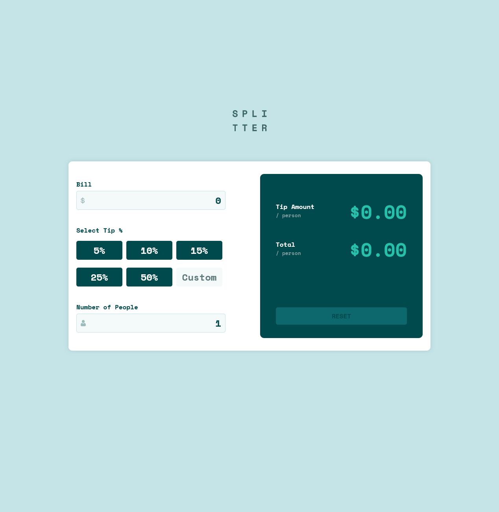

# Frontend Mentor - Tip calculator app solution

This is a solution to the [Tip calculator app challenge on Frontend Mentor](https://www.frontendmentor.io/challenges/tip-calculator-app-ugJNGbJUX). Frontend Mentor challenges help you improve your coding skills by building realistic projects.

## Table of contents

- [Overview](#overview)
  - [The challenge](#the-challenge)
  - [Screenshot](#screenshot)
  - [Links](#links)
- [My process](#my-process)
  - [Built with](#built-with)
  - [What I learned](#what-i-learned)
  - [Continued development](#continued-development)
- [Author](#author)

## Overview

### The challenge

Users should be able to:

- See hover states for all interactive elements on the page
- Calculate the correct tip and total cost of the bill per person

### Screenshot

### Links

- Solution URL: [Github]([[https://your-solution-url.com](https://github.com/nas22663/FE-tipcalculator)](https://github.com/nas22663/FE-tipcalculator))
- Live Site URL: [Live]([[https://your-live-site-url.com](https://nas22663.github.io/FE-tipcalculator/)](https://nas22663.github.io/FE-tipcalculator/))

## My process

### Built with

- React
- CSS custom properties
- Flexbox
- CSS Grid
- [React](https://reactjs.org/) - JS library

### What I learned

This would be my first react solo project hopefully it turned out okay would love any feedback

### Continued development

wish i can understand how frontend and backend connect on larger projects .

## Author

- Frontend Mentor - [@nas22663](https://www.frontendmentor.io/profile/nas22663)
